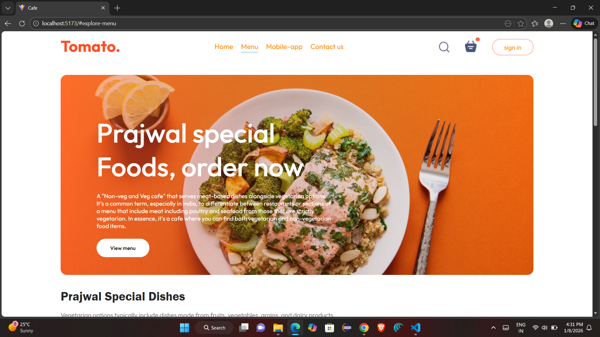
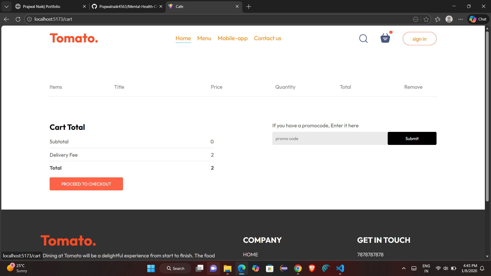
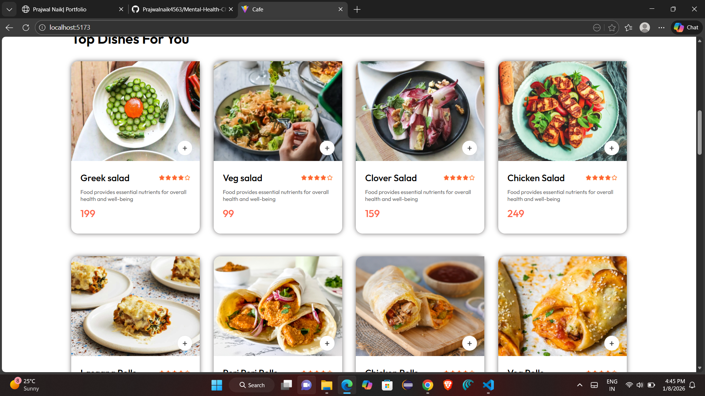
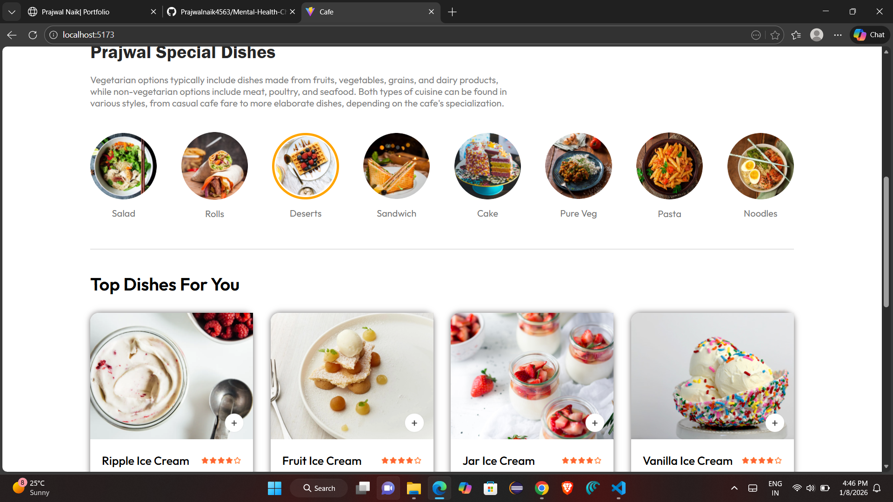

# 🍅 Tomato Café – Food Ordering Web App

A modern **React-based food ordering web application** inspired by popular café platforms.  
Users can explore the menu, view special dishes, add items to the cart, and place orders seamlessly.

---

## 🚀 Features

- 🏠 Home page with hero banner and featured dishes  
- 📋 Explore food menu by category  
- 🛒 Cart functionality  
- 🔐 Login popup (UI-based)  
- 📦 Place order page  
- 📱 Fully responsive design  
- ⚡ Fast performance using Vite  

---

## 🛠️ Tech Stack

- **Frontend:** React.js (Vite)
- **Routing:** React Router DOM
- **Styling:** CSS3
- **State Management:** React Hooks (`useState`)
- **Build Tool:** Vite

---

## 📁 Project Structure
```bash
src
├── main.jsx
├── App.jsx
├── index.css
├── assets
├── components
│ ├── Navbar
│ ├── Header
│ ├── ExploreMenu
│ ├── FoodDisplay
│ ├── FoodItem
│ ├── LoginPopup
│ └── Footer
└── pages
├── home
├── cart
└── placeorder
```

---

## 📌 Usage

1. Open the home page to view featured dishes  
2. Navigate to the **Menu** section to browse food items  
3. Add items to the cart  
4. Open the cart to review selected items  
5. Proceed to **Place Order**  
6. Login popup can be triggered using the **Sign In** button  


---

## ⚙️ Installation Guide

### 1️⃣ Clone the repository
```bash
git clone https://github.com/your-username/tomato-cafe.git
cd tomato-cafe
```

2️⃣ Install dependencies
```bash
npm install
```

3️⃣ Start the development server
```bash
npm run dev
```

4️⃣ Open in browser
http://localhost:5173/

📸 Demo
## 📸 Demo Screenshots

### 🏠 Home Page


### 📋 Cart Page


### 🛒 Menu Page


### 📦 Place Order Page


Developed by -Prajwal Naik [https://github.com/Prajwalnaik4563]
